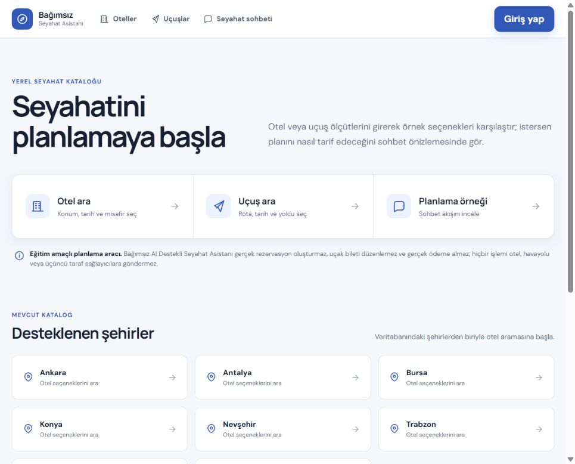
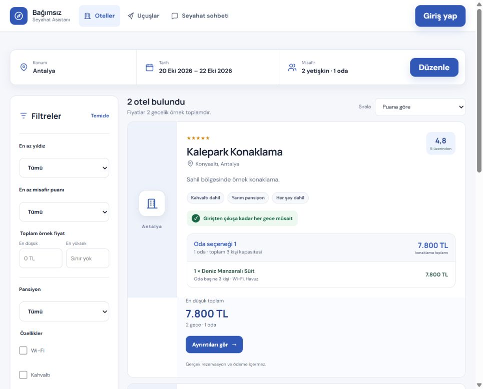
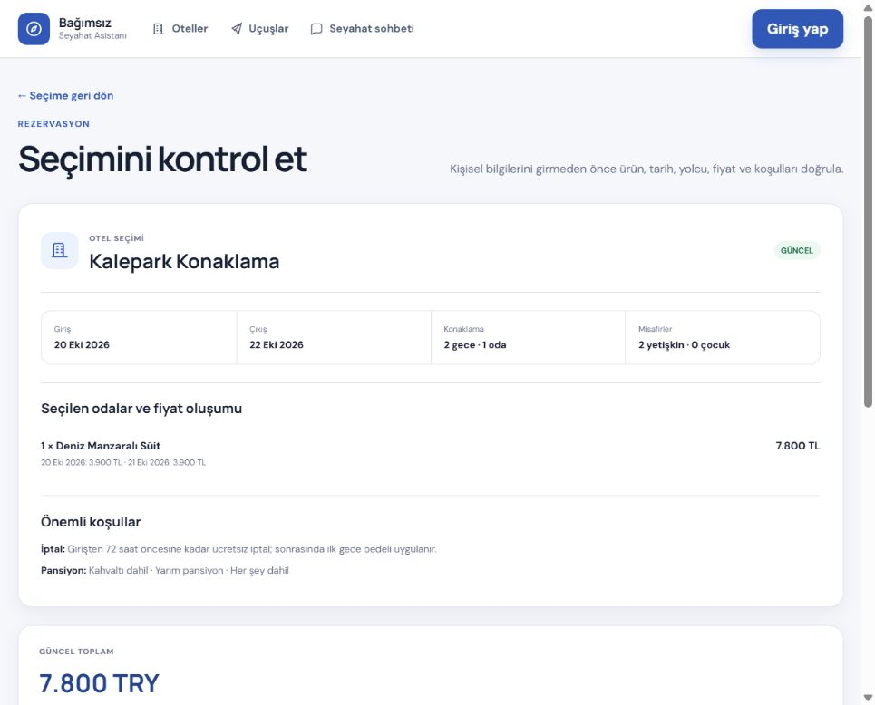

# Bağımsız AI Destekli Seyahat Asistanı

Yerel örnek veriler üzerinde otel ve uçuş araması, karşılaştırma, konuşmalı seyahat planlama ve rezervasyon simülasyonu sunan eğitim projesidir.

> Bu uygulama gerçek rezervasyon oluşturmaz, uçak bileti düzenlemez ve ödeme almaz. Hiçbir işlem otel, havayolu veya üçüncü taraf seyahat sağlayıcısına gönderilmez.

Bu dosya projeyi ilk kez gören biri için ana başlangıç noktasıdır. Kurulum, örnek hesap, ekranlar, demo akışı, testler ve bilinen sınırlar aşağıda birlikte açıklanır.

## İçindekiler

- [Özellikler](#özellikler)
- [Teknoloji ve klasörler](#teknoloji-ve-klasörler)
- [Temiz kurulum](#temiz-kurulum)
- [Örnek kullanıcı](#örnek-kullanıcı)
- [Temel ekranlar](#temel-ekranlar)
- [Uçtan uca demo](#uçtan-uca-demo)
- [API](#api)
- [Test ve kalite kontrolü](#test-ve-kalite-kontrolü)
- [Önemli teknik kararlar](#önemli-teknik-kararlar)
- [Bilinen sınırlar](#bilinen-sınırlar)
- [Sorun giderme](#sorun-giderme)

## Özellikler

- Form veya sohbet üzerinden örnek otel ve uçuş verilerinde arama
- Fiyat, süre, yıldız, puan, havayolu, aktarma ve bagaj gibi ölçütlerle karşılaştırma
- Güncel fiyat ve müsaitliği son onaydan önce yeniden kontrol etme
- Aynı isteğin iki rezervasyon kaydı oluşturmasını engelleyen güvenli onay akışı
- Kullanıcıya ait rezervasyonları listeleme, ayrıntılandırma ve uygun olanları iptal etme
- Doğal cümlelerden otel/uçuş ölçütlerini tamamlama ve mevcut sonuçları daraltma
- AI servisi yokken sınırlı yerel anlayıcıya ve klasik formlara geri dönme
- Telefon, tablet ve masaüstüne uyarlanan klavye erişilebilir arayüz

## Teknoloji ve klasörler

| Bölüm | Teknoloji / görev |
| --- | --- |
| `backend/TravelAssistant.Api` | .NET 8 minimal Web API, Npgsql, Swagger |
| `frontend` | React 19, TypeScript, Vite |
| `database/init` | Sıralı PostgreSQL migration ve örnek katalog verileri |
| `backend/TravelAssistant.Api.Tests` | Arama, konuşma, rezervasyon, yetki ve eş zamanlılık testleri |
| `docs/screenshots` | README içinde kullanılan güncel uygulama görüntüleri |
| `content/project-identity.json` | Proje adı, açıklaması ve hizmet sınırı için tek doğruluk kaynağı |

`docker-compose.yml` yalnızca isteğe bağlıdır. Uygulama yerel PostgreSQL Windows servisiyle Docker kullanmadan çalışabilir.

## Temiz kurulum

### 1. Gereksinimler

- Git
- [.NET 8 SDK](https://dotnet.microsoft.com/download/dotnet/8.0)
- Node.js 20 veya üzeri ve npm
- PostgreSQL 16 veya üzeri

PowerShell'de sürümleri kontrol edin:

```powershell
git --version
dotnet --version
node --version
npm --version
psql --version
```

`psql` PATH üzerinde değilse bu son komutun çalışmaması PostgreSQL sunucusunun çalışmadığı anlamına gelmez. Windows'ta servisi ayrıca kontrol edebilirsiniz:

```powershell
Get-Service postgresql*
```

### 2. Kaynak kodu alın

```powershell
git clone https://github.com/senagokaslan/ai-travel-assistant.git
Set-Location ai-travel-assistant
```

### 3. Yerel PostgreSQL ayarını oluşturun

Örnek dosyayı Git tarafından izlenmeyen yerel ayar dosyasına kopyalayın:

```powershell
Copy-Item backend/TravelAssistant.Api/appsettings.Local.example.json backend/TravelAssistant.Api/appsettings.Local.json
```

`appsettings.Local.json` içindeki iki `CHANGE_ME_...` değerini yalnızca kendi bilgisayarınızdaki parolalarla değiştirin:

- `Postgres`: uygulamanın kullanacağı `travel_assistant_app` rolünün parolası
- `PostgresAdmin`: ilk kurulumda rolü/veritabanını oluşturabilen yerel `postgres` yöneticisinin parolası

Gerçek parolaları README'ye, `.env.example` dosyasına, ekran görüntülerine veya Git'e eklemeyin. `appsettings.Local.json` zaten `.gitignore` kapsamındadır.

PostgreSQL servisi çalışıyorsa backend geliştirme ortamında:

1. `travel_assistant_app` rolünü ve `travel_assistant` veritabanını yoksa oluşturur.
2. `database/init` altındaki sürümlü migration'ları dosya adına göre uygular.
3. Uygulanan migration'ları `schema_migrations` tablosunda izler.

Mevcut rol ve veritabanı zaten hazırsa `PostgresAdmin` bağlantısı kullanılmaz. Üretim/paylaşılan ortamda otomatik veritabanı oluşturma açık değildir.

### 4. Bağımlılıkları yükleyin

```powershell
dotnet restore TravelAssistant.slnx
npm --prefix frontend ci
```

### 5. Backend'i çalıştırın

Birinci terminal:

```powershell
dotnet run --project backend/TravelAssistant.Api
```

Beklenen adresler:

- API: `http://localhost:5080/api`
- Sağlık kontrolü: `http://localhost:5080/api/health`
- Swagger: `http://localhost:5080/swagger`

Sağlık kontrolü:

```powershell
Invoke-RestMethod http://localhost:5080/api/health | ConvertTo-Json -Depth 4
```

Hem `api.status` hem `database.status` değeri `healthy` olmalıdır.

### 6. Frontend'i çalıştırın

İkinci terminal:

```powershell
npm --prefix frontend run dev
```

Tarayıcıda `http://localhost:5173` adresini açın. Vite, `/api` isteklerini `http://localhost:5080` adresindeki backend'e yönlendirir.



## Örnek kullanıcı

Temiz veritabanında önceden tanımlanmış kullanıcı veya ortak parola bulunmaz. Bu karar, örnek bir parolanın kaynak kodda kalmasını önler.

Demo için `/login` ekranında **Hesap oluştur** sekmesini kullanın. Örneğin:

| Alan | Yerel demo değeri |
| --- | --- |
| Ad soyad | `Demo Kullanıcı` |
| E-posta | `demo.user@example.test` |
| Parola | Yalnızca yerel demo için kendiniz belirleyin; en az 8 karakter, büyük/küçük harf ve rakam içermeli |
| Rol | Yeni hesaplarda otomatik olarak `user` |

Bu bilgiler yalnızca örnektir; hesap form gönderildiğinde sizin yerel PostgreSQL veritabanınızda oluşur. Parolalar PBKDF2-SHA256, rastgele salt ve 600.000 iterasyonla özetlenerek saklanır; açık parola saklanmaz.

Admin hesabı bilinçli olarak seed edilmez. `/admin` yalnızca veritabanında rolü `admin` olan yerel hesaplara açıktır ve normal rezervasyon demosu için gerekli değildir.

## Temel ekranlar

| Adres | Erişim | İçerik |
| --- | --- | --- |
| `/` | Herkes | Başlangıç seçenekleri, desteklenen şehirler ve sistem kapsamı |
| `/hotels` | Herkes | Otel konumu, tarih, oda ve misafir formu |
| `/hotels/results` | Herkes | Otel sonuçları, birleşik filtreler ve sıralama |
| `/hotels/:id` | Herkes | Oda seçenekleri, gecelik fiyatlar ve koşullar |
| `/flights` | Herkes | Havaalanı, tarih, yolcu, uçuş sonuçları ve filtreler |
| `/booking/summary` | Herkes | Seçilen ürünün güncel fiyat, müsaitlik ve koşul özeti |
| `/login` | Herkes | Yerel hesap oluşturma ve giriş |
| `/chat` | Giriş gerekli | Konuşma geçmişi, doğal dilde arama ve sonuç kartları |
| `/bookings` | Giriş gerekli | Giriş yapan kullanıcının rezervasyon simülasyonları |
| `/bookings/:id` | Giriş gerekli | Rezervasyon ayrıntısı ve uygun kayıtlar için iptal |
| `/profile` | Giriş gerekli | Kullanıcı profili ve tercihleri |
| `/admin` | Admin gerekli | Örnek katalog yönetimi |

Korumalı bir adrese anonim gidildiğinde `/login?returnTo=...` adresine yönlendirilirsiniz. Girişten sonra hedef sayfa açılır. Başka kullanıcının rezervasyonuna doğrudan bağlantıyla erişim engellenir.

## Uçtan uca demo

Aşağıdaki akış temiz kurulumda otel aramasından rezervasyon simülasyonuna kadar uygulanabilir.

1. Backend, frontend ve PostgreSQL'in çalıştığını doğrulayın.
2. `/login` sayfasında yerel demo hesabınızı oluşturun. Uygulama otomatik olarak giriş yapar.
3. Üst menüden **Oteller** ekranını açın.
4. Şehir olarak `Antalya` seçin.
5. Giriş tarihini bugünden en az 14 gün sonraya, çıkış tarihini iki gün sonrasına ayarlayın.
6. `1 oda`, `2 yetişkin`, `0 çocuk` seçip **Otelleri ara** düğmesine basın.
7. Sonuçlarda puan/fiyat sıralamasını ve birden fazla filtreyi deneyin.



8. Bir otelde **Ayrıntıları gör** seçeneğini açın, uygun oda seçeneğini işaretleyin ve **Rezervasyon özetine geç** düğmesine basın.
9. Tarih, misafir, oda, gecelik fiyat, toplam ve iptal koşullarını kontrol edin. Bu aşamada henüz rezervasyon kaydı oluşmaz.



10. **Özeti açıkça onayla** seçeneğine basın.
11. İki yetişkinin ad/soyad bilgilerini ve eğitim amaçlı iletişim alanlarını doldurun. Gerçek kimlik, kart veya ödeme bilgisi girmeyin.
12. Son onayı verin. Sistem fiyatı ve stoku yeniden kontrol eder; başarılıysa benzersiz rezervasyon numarasını gösterir.
13. `/bookings` ekranında kaydı açın. Tarih başlamadıysa iptal onayını deneyin ve durumun `İptal edildi` olarak güncellendiğini doğrulayın.

Alternatif uçuş demosunda temiz kurulum gününe göre oluşturulan örnek seferler kullanılabilir: `IST → AYT` için kurulumdan sonraki 1. veya 14. gün; gidiş dönüş için dönüş tarihi 5. veya 18. gündür. İptal seferler ve yeterli koltuğu olmayan ücretler sonuçlara dahil edilmez.

## API

Swagger tüm güncel sözleşmeleri `http://localhost:5080/swagger` adresinde gösterir. Ayrıntılı endpoint tablosu, kimlik doğrulama biçimi ve çalıştırılabilir PowerShell örnekleri için [API kılavuzuna](docs/api-kilavuzu.md) bakın.

Kısa örnekler:

```powershell
# Sağlık
Invoke-RestMethod http://localhost:5080/api/health

# Konum önerileri
Invoke-RestMethod "http://localhost:5080/api/hotels/locations?q=Antalya"

# Bugünden 14 ve 16 gün sonrası için otel araması
$checkIn = (Get-Date).Date.AddDays(14).ToString('yyyy-MM-dd')
$checkOut = (Get-Date).Date.AddDays(16).ToString('yyyy-MM-dd')
Invoke-RestMethod "http://localhost:5080/api/hotels?q=Antalya&checkIn=$checkIn&checkOut=$checkOut&adults=2&rooms=1&children=0"
```

Korumalı endpoint'lerde giriş cevabındaki token şu başlıkla gönderilir:

```text
Authorization: Bearer <yerel-oturum-tokeni>
```

Token'ı belgeye, loga veya kaynak koduna eklemeyin.

## İsteğe bağlı AI anlayıcı

AI yapılandırılmadığında sohbet güvenli, sınırlı yerel anlayıcıyla çalışır. Uyumlu bir çıkarım ağ geçidi kullanmak için gizli değerleri yalnızca yerel ortam değişkenlerinde tutun:

```powershell
$env:AiAssistant__Endpoint = "https://ai-gateway.example/parse-travel"
$env:AiAssistant__ApiKey = "<YEREL_GIZLI_ANAHTAR>"
$env:AiAssistant__TimeoutSeconds = "4"
```

AI çıktısı kullanılmadan önce şema ve değer doğrulamasından geçer. Fiyat, stok, ürün ve rezervasyon verisi AI'dan kabul edilmez; daima PostgreSQL kayıtlarından okunur. Ağ geçidi bozuk cevap verir, zaman aşımına uğrar veya kullanılamazsa klasik form ve yerel anlayıcı çalışmaya devam eder.

## Test ve kalite kontrolü

PostgreSQL ve backend bağlantısı hazırken:

```powershell
dotnet test TravelAssistant.slnx --configuration Release
npm --prefix frontend run lint
npm --prefix frontend run build
```

Backend testleri her çalıştırmada rastgele adlandırılmış geçici PostgreSQL şeması kullanır ve uygulama tablolarına yazmaz. Paket; başarılı/başarısız aramalar, geçersiz tarih/konum, konuşma bağlamı, stok yarışı, rezervasyon idempotency'si ve başka kullanıcının kaydına erişememe senaryolarını kapsar.

Bu belgedeki kurulum komutlarının son doğrulaması için bağımlılıklar `npm ci` ve `dotnet restore` ile yeniden kurulmalı; ardından yukarıdaki test, lint ve build komutları çalıştırılmalıdır.

## Önemli teknik kararlar

- **PostgreSQL tek veri kaynağıdır:** fiyat, stok, ürün ve rezervasyon bilgisi model çıktısından üretilmez.
- **Migration'lar sürümlüdür:** uygulanmış SQL dosyaları değiştirilmez; yeni değişiklik yeni numaralı dosyayla eklenir.
- **Son onay atomiktir:** fiyat/stok yeniden okunur, ilgili satırlar kilitlenir ve başarısız işlem yarım kayıt bırakmaz.
- **Onaylar idempotenttir:** kullanıcı ve `requestKey` birleşimi çift tıklama veya tekrar denemede ikinci kayıt oluşturmaz.
- **Sahiplik her istekte doğrulanır:** liste, ayrıntı ve iptal işlemleri oturumdaki kullanıcı kimliğiyle sınırlandırılır.
- **Gizli ayarlar sunucudadır:** frontend bağlantı dizesi veya AI anahtarı içermez.
- **AI yardımcıdır:** yalnızca niyet/alan çıkarımı ve cevap dili için kullanılır; düşük güvenle arama ya da rezervasyon başlatılmaz.

Proje kapsamının değişmez tanımı [proje kimliği belgesinde](docs/proje-kimligi-ve-kapsami.md), makine tarafından okunabilir karşılığı [project-identity.json](content/project-identity.json) dosyasındadır.

## Bilinen sınırlar

- Katalog ve fiyatlar eğitim amaçlı yerel örnek veridir; canlı sağlayıcı bağlantısı yoktur.
- Ödeme, e-posta doğrulama, parola sıfırlama ve gerçek kimlik doğrulama akışı yoktur.
- Oturum tokenları backend belleğinde tutulur; backend yeniden başladığında tekrar giriş gerekir.
- Temiz kurulum admin hesabı oluşturmaz.
- Örnek uçuş tarihleri migration'ın ilk uygulandığı güne göre üretilir. Uzun süre kullanılan bir veritabanında bu uçuşlar geçmişte kalabilir.
- Örnek otel fiyat/müsaitlik takvimi migration gününden itibaren sınırlı bir dönem için oluşturulur.
- Para birimleri doğrudan toplanmaz veya çevrilmez; farklı para birimli uçuşlar ayrı gösterilir.
- AI entegrasyonu belirli bir sağlayıcı SDK'sına bağlı değildir; yapılandırılan HTTP ağ geçidinin beklenen JSON sözleşmesine uyması gerekir.
- Uygulama tek makinede eğitim/demonstrasyon kullanımına yöneliktir; dağıtık oturum deposu ve üretim gözlemlenebilirliği içermez.

## Sorun giderme

### Sağlık kontrolünde veritabanı `unhealthy`

- PostgreSQL servisinin çalıştığını kontrol edin: `Get-Service postgresql*`
- `appsettings.Local.json` dosyasının varlığını kontrol edin.
- Veritabanı, kullanıcı ve port değerlerini doğrulayın; parolayı terminal çıktısına yazdırmayın.
- İlk kurulumda `PostgresAdmin` bağlantısının yerel yönetici hesabına ait olduğundan emin olun.

### Port kullanımda

Frontend sabit olarak `5173`, backend `5080` portunu kullanır. Aynı portta çalışan önceki süreci kapatın veya önce o sürecin zaten uygulama olup olmadığını sağlık adresinden kontrol edin.

### Otel veya uçuş sonucu yok

- Tarihin geçmişte olmadığını kontrol edin.
- Havaalanı kodunu öneri listesinden seçin; şehir metnini yalnız bırakmayın.
- Uçuş örnek tarihlerinin migration tarihine bağlı olduğunu unutmayın.
- Otel demosu için `Antalya`, bugünden 14–16 gün sonrası, 1 oda ve 2 yetişkin kullanın.

### Sohbet açılmıyor

`/chat` giriş gerektirir. Önce `/login` ekranından hesap oluşturun veya giriş yapın. AI servisi tanımlı değilse sohbet yine yerel anlayıcıyla çalışır.
